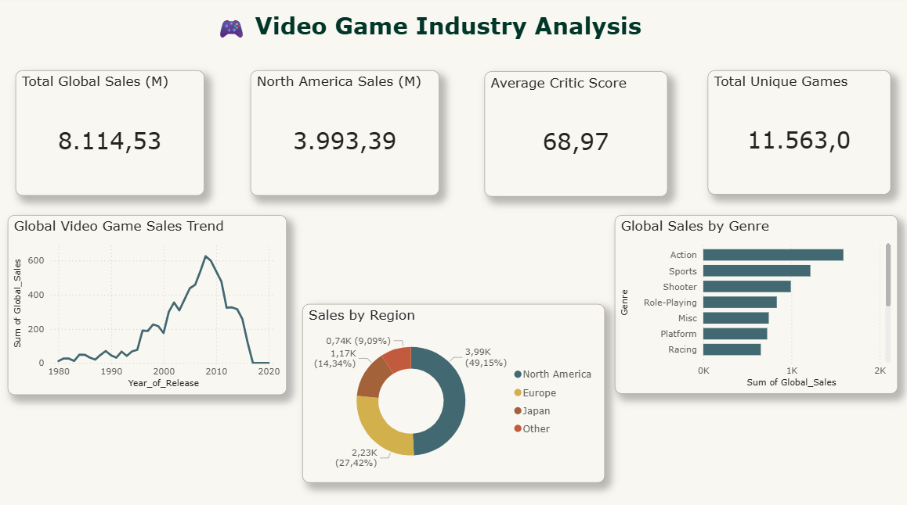
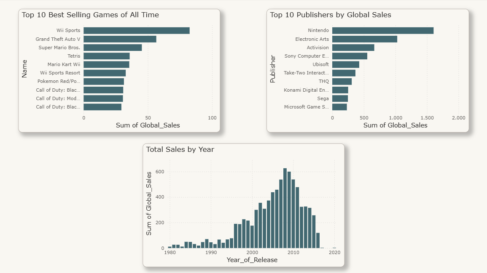
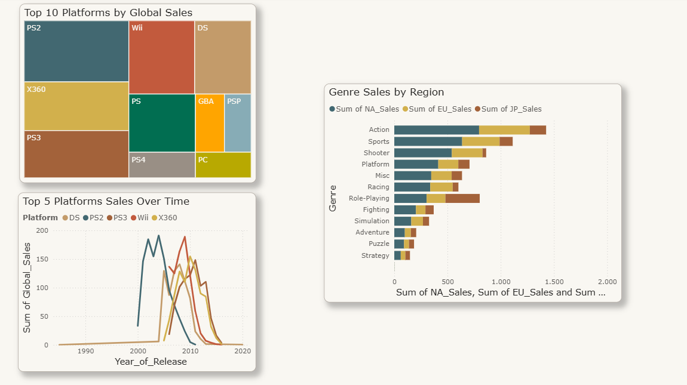
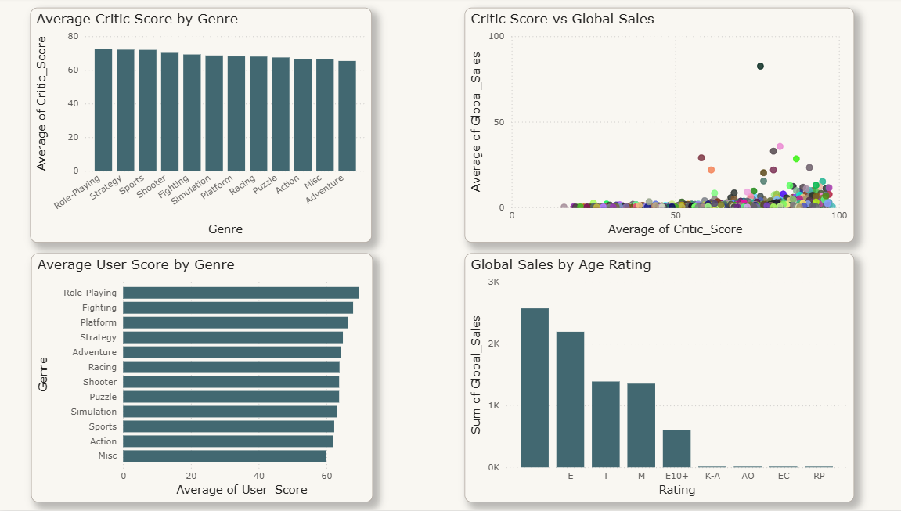

# 🎮 Video Game Industry Analysis (1980-2016)

> A comprehensive data analysis of 16,700+ video games using SQL for querying and Power BI for interactive visualization — covering sales trends, platform performance, publisher dominance, and ratings analysis.


---

## 📌 Project Overview

This project performs an end-to-end analysis of the global video game industry using a real Kaggle dataset containing 16,700+ games released between 1980 and 2016. The analysis covers sales by region, platform, genre, publisher, and the relationship between critic scores and commercial success.

**Dataset:** [Video Game Sales with Ratings — Kaggle](https://www.kaggle.com/datasets/rush4ratio/video-game-sales-with-ratings)

---

## 🖥️ Dashboard Pages

### Page 1 — Sales Overview


### Page 2 — Top Games & Publishers


### Page 3 — Platform & Genre Analysis


### Page 4 — Ratings & Reviews


---

## 🔍 Key Findings

| Finding | Insight |
|---------|---------|
| 🌍 **Market dominance** | North America accounts for 49% of all global sales |
| 🏆 **Best selling game** | Wii Sports — 82.53 million copies sold |
| 🎮 **Top platform** | PS2 — $1,255M total sales across 2,161 games |
| 🏢 **Top publisher** | Nintendo — $1,788M with avg $2.53M per game |
| 🎯 **Best genre by volume** | Action — $1,745M total global sales |
| 📈 **Industry peak** | 2008 — $671M in annual sales |
| ⭐ **Quality vs sales** | 90+ score games sell 10x more than poor-rated games |
| 👶 **Age rating** | E (Everyone) games generate the most revenue |

---

## 🛠️ Tools & Workflow

| Tool | Purpose |
|------|---------|
| **Excel/WPS** | Initial data exploration and viewing |
| **SQLite Online** | SQL queries for business analysis |
| **Power BI Desktop** | Data cleaning, modeling and dashboard |
| **Power Query** | Data transformation and cleaning |

---

## 📊 SQL Analysis

Seven business queries were written to extract insights before visualization:

**1. Overall market size**
```sql
SELECT 
    COUNT(*) as total_games,
    ROUND(SUM(global_sales), 2) as total_global_sales_millions,
    ROUND(SUM(na_sales), 2) as total_na_sales,
    ROUND(SUM(eu_sales), 2) as total_eu_sales,
    ROUND(SUM(jp_sales), 2) as total_jp_sales
FROM Video_Games_Sales_as_at_22_Dec_2016
WHERE global_sales > 0;
```
→ 16,719 games, $8,920M total global sales | NA 49% | EU 27% | JP 15%

**2. Top 10 best selling games**
```sql
SELECT 
    name,
    platform,
    genre,
    publisher,
    year_of_release,
    global_sales,
    na_sales,
    eu_sales,
    jp_sales
FROM Video_Games_Sales_as_at_22_Dec_2016
WHERE global_sales > 0
ORDER BY global_sales DESC
LIMIT 10;
```
→ Wii Sports #1 at 82.53M | All top 10 are Nintendo titles

**3. Sales by genre**
```sql
SELECT 
    genre,
    COUNT(*) as total_games,
    ROUND(SUM(global_sales), 2) as total_sales,
    ROUND(AVG(global_sales), 2) as avg_sales_per_game,
    ROUND(SUM(na_sales), 2) as na_sales,
    ROUND(SUM(eu_sales), 2) as eu_sales,
    ROUND(SUM(jp_sales), 2) as jp_sales
FROM Video_Games_Sales_as_at_22_Dec_2016
WHERE global_sales > 0
GROUP BY genre
ORDER BY total_sales DESC;
```
→ Action dominates at $1,745M | Shooter highest avg at $0.80M | Role-Playing is Japan's #1

**4. Top 10 publishers**
```sql
SELECT 
    publisher,
    COUNT(*) as total_games,
    ROUND(SUM(global_sales), 2) as total_sales,
    ROUND(AVG(global_sales), 2) as avg_sales_per_game,
    ROUND(MAX(global_sales), 2) as best_selling_game_sales
FROM Video_Games_Sales_as_at_22_Dec_2016
WHERE global_sales > 0
AND publisher != 'Unknown'
GROUP BY publisher
ORDER BY total_sales DESC
LIMIT 10;
```
→ Nintendo $1,788M avg $2.53M per game (3x industry avg) | EA 2nd at $1,116M

**5. Top platforms**
```sql
SELECT 
    platform,
    COUNT(*) as total_games,
    ROUND(SUM(global_sales), 2) as total_sales,
    ROUND(AVG(global_sales), 2) as avg_sales_per_game,
    ROUND(SUM(na_sales), 2) as na_sales,
    ROUND(SUM(eu_sales), 2) as eu_sales,
    ROUND(SUM(jp_sales), 2) as jp_sales
FROM Video_Games_Sales_as_at_22_Dec_2016
WHERE global_sales > 0
GROUP BY platform
ORDER BY total_sales DESC
LIMIT 15;
```
→ PS2 all-time #1 at $1,255M | GB/NES highest avg efficiency at $2.61/$2.56M

**6. Critic score vs sales**
```sql
SELECT 
    CASE 
        WHEN critic_score >= 90 THEN '90-100 (Outstanding)'
        WHEN critic_score >= 80 THEN '80-89 (Great)'
        WHEN critic_score >= 70 THEN '70-79 (Good)'
        WHEN critic_score >= 60 THEN '60-69 (Mixed)'
        ELSE 'Below 60 (Poor)'
    END as score_category,
    COUNT(*) as total_games,
    ROUND(AVG(global_sales), 2) as avg_global_sales,
    ROUND(SUM(global_sales), 2) as total_sales
FROM Video_Games_Sales_as_at_22_Dec_2016
WHERE critic_score IS NOT NULL 
AND global_sales > 0
GROUP BY score_category
ORDER BY avg_global_sales DESC;
```
→ 90-100 scored games avg $2.83M — 10x more than poor-rated games at $0.27M

**7. Sales trend by year**
```sql
SELECT 
    year_of_release,
    COUNT(*) as total_games,
    ROUND(SUM(global_sales), 2) as total_sales,
    ROUND(AVG(global_sales), 2) as avg_sales_per_game
FROM Video_Games_Sales_as_at_22_Dec_2016
WHERE global_sales > 0
AND year_of_release IS NOT NULL
AND year_of_release != 'N/A'
AND CAST(year_of_release AS INTEGER) BETWEEN 1980 AND 2016
GROUP BY year_of_release
ORDER BY year_of_release ASC;
```
→ Industry peaked in 2008 at $671M | Declined after mobile gaming rise

---

## 📁 Project Structure
```
gaming-analysis/
├── Video_Games_Sales_as_at_22_Dec_2016.csv  # Raw dataset
├── Video_Game_Industry_Analysis.pbix         # Power BI dashboard
├── page1_sales_overview.png                  # Dashboard screenshot
├── page2_top_games.png                       # Dashboard screenshot
├── page3_platform_genre.png                  # Dashboard screenshot
├── page4_ratings.png                         # Dashboard screenshot
└── README.md
```

---

## 💡 What I Learned

- Writing **business-focused SQL queries** to extract actionable insights
- **Power Query** data cleaning — fixing data types, replacing values, dividing columns
- Building **multi-page Power BI dashboards** with consistent design
- Using **Top N filters** in Power BI for ranked visualizations
- **Treemap, scatter, donut** and stacked bar chart design
- Translating raw data into **executive-level business insights**

---

## 📄 License
MIT License
